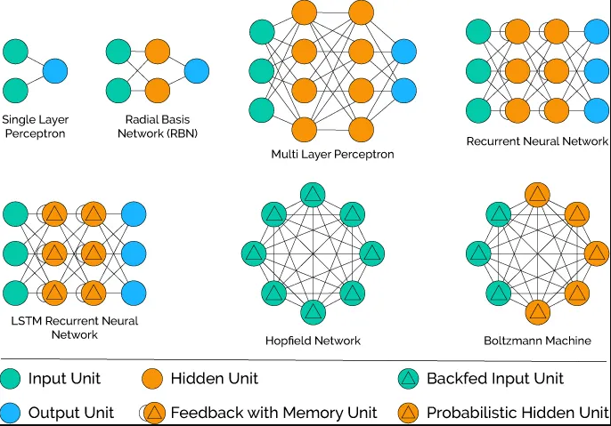

## Detecção de cancer através de redes neurais
### Multi Layer Perceptron
Multilayer Perceptron ( MLP ) é uma rede neural artificial consistindo de neurônios totalmente conectados com um tipo não linear de função de ativação, organizados em pelo menos três camadas, notável por ser capaz de distinguir dados que não são linearmente separáveis .

Fonte:
[sklearn.neural_network.MLPClassifier](https://scikit-learn.org/stable/modules/generated/sklearn.neural_network.MLPClassifier.html)